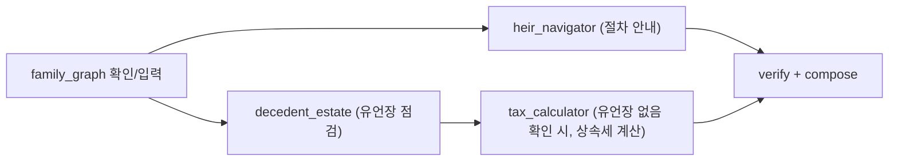
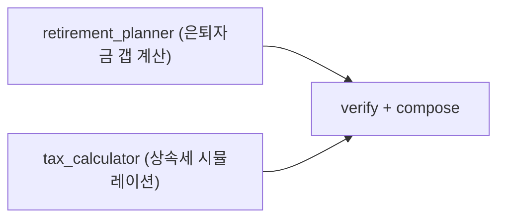

---

# 핵심 아이디어 — 라우터에서 플래너로

| **BEFORE — 라우터** | **AFTER — 플래너** |
| --- | --- |
| 키워드 매칭 1회로 에이전트 이름 하나 확정 | 레지스트리에 선언만 하면 새 에이전트가 라우팅 후보로 자동 편입 |
| 새 에이전트 추가 = 매핑 코드 직접 수정 | 필요 시 여러 에이전트를 의존성 기반으로 병렬/순차 실행 |
| 여러 도메인이 겹치는 요청은 하나만 응답 | 결과를 하나로 합성 + 숫자·판정은 코드로 검증 후 응답 |
| 결과를 그대로 사용자에게 전달 | - |

파이프라인은 `classify → build_plan → execute_plan → compose` 4단계로 확장됩니다.

---

# 4가지 축

### 축 1 · Registry — 에이전트가 스스로를 선언한다

각 에이전트가 `AgentSpec` 하나를 등록하면 오케스트레이터 핵심 코드 수정 없이 라우팅 후보로 편입됩니다.

```python
class AgentSpec(BaseModel):
    name: AgentName
    axis: AgentAxis              # pre_need / post_death
    description: str             # 라우팅 LLM용 한 줄 설명
    example_utterances: list[str]  # few-shot 라우팅 예시 문장
    keywords: list[str]          # 빠른 경로용 키워드
    requires: list[str] = []     # 필요로 하는 공통 컨텍스트 필드
    produces: list[str] = []     # 만들어내는 공통 컨텍스트 필드
    entrypoint: Callable[[AgentInput], Awaitable[AgentOutput]]
```

### 축 2 · Classify — 키워드 우선, 애매할 때만 LLM

| 등급 | 조건 | 처리 방식 | 목표시간 |
| --- | --- | --- | --- |
| **Fast Path** | 후보 1개, 직전 핸드오프와 일치 | build_plan 생략 → 바로 call_agent | ~3초 |
| **Standard Path** | 후보 1개, 새 라우팅 필요 | 키워드 매칭만으로 단일 노드 plan | ~5초 |
| **Full Pipeline** | 후보 2개 이상 (축이 겹침) | LLM 분류 → DAG 빌드 → 병렬/순차 실행 → compose | ~15~20초 |

Fast Path는 지금 구조와 동일하게 빠르고 저렴, Full Pipeline은 축이 겹치는 애매한 요청에서만 LLM 판단력을 사용합니다.

### 축 3 · Execute — 의존성 기반 DAG로 병렬·순차 실행

`requires`/`produces`가 안 겹치면 병렬(`asyncio.gather`), 겹치면 순차로 앞 결과를 다음 에이전트의 context에 주입합니다.



*시나리오 A — "아버지가 어제 돌아가셨어요" (사후처리 축, 병렬+순차 혼합)*



*시나리오 B — "은퇴 준비하면서 상속세도 궁금해요" (생전준비 축, 완전 병렬 — 이번 재설계의 목표를 데모에서 보여주는 핵심 케이스)*

### 축 4 · Compose — 합성과 검증을 분리한다 (가장 중요한 반영 사항)

<aside>
🔴

지금까지 "숫자·법률 판단은 원문 그대로"는 **프롬프트 약속**이었습니다 — LLM이 지키지 않아도 걸러낼 방법이 없었습니다. 심사위원이 직접 숫자를 입력해볼 가능성이 높은 지점이라, 이번 재설계에서 **가장 먼저 반영할 항목**입니다.

</aside>

```python
def compose(agent_outputs: list[AgentOutput], user_message: str) -> ComposedReply:
    draft = llm_synthesize(agent_outputs, user_message)   # 기존 compose
    verified = verify_numbers(draft, agent_outputs)        # 신규 — 코드 규칙
    if not verified.ok:
        # 숫자/판정이 원문과 다르면 LLM 합성을 버리고
        # 각 에이전트 reply를 그대로 이어붙이는 폴백 + "⚠️ 확인필요" 배지
        return fallback_concat(agent_outputs)
    return draft
```

`verify_numbers()`는 draft에 등장하는 금액·퍼센트·날짜를 정규식으로 뽑아, 원본 `agent_outputs`의 data/reply 안에 정확히 존재하는지 문자열로 대조하는 **코드 규칙**입니다.

---

# 데이터 계약 변화 (AgentInput / AgentOutput)

기존 필드는 유지 — **3개 에이전트 내부 로직은 무변경**, 진입점만 얇게 어댑팅합니다.

| 필드 | BEFORE | AFTER |
| --- | --- | --- |
| session_id / user_message | 동일 | 동일 |
| family_graph | Optional[dict] | 동일 |
| financial_profile | — 없음 — | **신규, 1급 필드** (FinancialProfile) |
| context | dict[str, Any] (자유 형식) | dict[str, dict] (네임스페이스 강제, 레거시 평면구조 폐기) |
| next_action | Optional[str] ("handoff:xxx") | list[HandoffRequest] (구조화, 우선순위 포함) |

`financial_profile`을 family_graph처럼 세션에 붙어사는 공유 상태로 승격해서, 은퇴자금 설계 에이전트가 물어본 자산 정보를 tax_calculator가 재질문 없이 그대로 쓸 수 있게 합니다.

<aside>
📌

**decedent_estate의 레거시 평면 context 어댑터(`LEGACY_FLAT_CONTEXT_AGENTS`)는 이번 재설계를 계기로 반드시 제거합니다.** 이미 네임스페이스 전환 PR(#15)이 코드 리뷰까지 끝나 있으니, 이번에 머지하고 새 계약에 맞춰 정리하는 게 적기입니다.

</aside>

---

# 구현 메모 (2026-08-28, 브랜치 feat(라우팅변경))

위 설계를 구현하면서 문서와 다르게 결정한 것들입니다. 코드: `apps/api/orchestrator/{registry,planner,compose,router}.py`, `apps/api/agents/*/spec.py`.

| 항목 | 문서 | 실제 구현 | 이유 |
| --- | --- | --- | --- |
| `LEGACY_FLAT_CONTEXT_AGENTS` | 제거 | **그대로 둠** (`handoff.py`) | PR #15는 이미 머지돼 집합이 비어 있음. 담당 파트가 달라 이번 범위에서 제외 |
| `next_action` | `list[HandoffRequest]`로 교체 | `next_action: Optional[str]` **유지** + `handoffs: list[HandoffRequest]` **추가** | decedent_estate가 `"await_user_confirmation"` 같은 비핸드오프 값을 쓰고 있어 타입을 바꾸면 그쪽 코드를 건드려야 함. `handoffs`가 비어 있으면 레거시 `"handoff:x"`를 파싱 |
| `context: dict[str, dict]` 강제 | 네임스페이스 강제 | **미적용** (`dict[str, Any]`) | tax_calculator가 `context["tax_input"]` 평면 키를 읽고, 레거시 어댑터 무변경 결정과 충돌 |
| `financial_profile` 저장 | (미지정) | `sessions.per_agent_context["_shared"]["financial_profile"]` | 컬럼/마이그레이션 추가 없이 기존 테이블 사용 |
| 병렬 실행 | `asyncio.gather` + async entrypoint | 동기 `run()` 그대로, 층 단위 `ThreadPoolExecutor` | 세 에이전트·`/chat`·세션 스토어가 전부 동기 |
| `/chat` 응답 | (미지정) | `ChatResponse` = `AgentOutput` + `agents`/`path`/`verification` | 프론트 `types.ts`, DevPanel, ⚠️ 배지 함께 반영 |
| heir_navigator 키워드 | (없음) | `돌아가셨/사망신고/상속포기/한정승인/절차` 추가 | 시나리오 A처럼 후보가 2개 이상 잡혀야 Full Pipeline이 발동 |
| 추가 에이전트 | `retirement_planner` | `retirement_planner` + `asset_organizer` **껍데기 2개** | 팀 계획이 2개. `agents/<이름>/agent.py`의 `run()`만 채우고 `spec.py`의 `is_stub=False` |

LLM 강등 규칙: 키 없음·호출 실패·거절 시 classify는 **키워드 후보 전부 실행**, compose는 **원문 이어붙이기**(`verification.mode="concat"`, ok=True). `ORCHESTRATOR_USE_LLM=0`으로 강제 off.

아직 안 한 것: 실제 API 키로 Full Pipeline의 LLM 분류·합성 품질 확인, Postgres 환경에서 `_shared` 키 세션 왕복 확인(CI에서 검증됨).

---

# 2차 변경 — LLM-first 라우팅 (2026-09-04, 브랜치 feature/llm-first-routing)

## 왜

축 2 "키워드 우선, 애매할 때만 LLM"은 키워드가 **힌트가 아니라 게이트**였다. 키워드 매칭 결과가 LLM 후보의 상한이라, 키워드가 틀리면 LLM 이 교정할 기회 자체가 없었다. 실운영에서 두 증상이 반복됐다:

| 증상 | 원인 | 예 |
| --- | --- | --- |
| 진행 중인 대화를 다른 에이전트가 가로챔 (하이재킹) | 직전 질문에 답하는 발화가 다른 에이전트 키워드에 걸림 → 후보 1개 → Standard 확정 호출 | heir_navigator "고인 명의 예금 계좌가 있나요?" → "네, **은행 계좌** 하나 있어요" → asset_organizer |
| 호출돼야 할 에이전트가 안 나옴 (관성) | 키워드 0개 → LLM 호출 없이 `last_agent` 폴백. `pending_handoff` 는 키워드조차 안 봄 | asset_organizer 대화 중 "큰애한테 다 주고 싶은데 괜찮을까요" → 계속 asset_organizer |

`spec.py` 마다 "실측 재현"이라며 키워드를 늘려온 것(`은행/예금/계좌…`, `자녀에게만/분쟁/형평…`)은 관성을 막으려다 하이재킹을 키우는 땜질이었다.

## 무엇이 바뀌었나 (`orchestrator/planner.py`)

```
classify(user_message, pending_handoff, last_agent, default_agent, axis, history)
  keyword_hits = match_keywords(msg)                # 힌트로만 씀
  selected = _llm_route(msg, 대화 상태, keyword_hits)  # LLM 사용 가능할 때
  ├─ 1개  → Standard
  ├─ 2개+ → build_plan (Full, requires/produces DAG)
  └─ None → _rule_classify(keyword_hits, …)        # 이전 규칙 그대로 (Fast/Standard/Full)
```

1. **후보 전체 개방** — LLM 의 `enum` 이 키워드 후보가 아니라 등록된 에이전트 전부(`is_stub` 제외). 관성 해소.
2. **대화 상태를 라우터에 배선** — `router.node_classify` 가 `session.history` 를 넘기고, 마지막 assistant 발화(=직전 질문)·직전 에이전트·핸드오프 예정·키워드 힌트가 user 프롬프트에 들어간다. 하이재킹 해소.
3. **`__continue__` 선택지** — 직전 에이전트가 있으면 "이어가기"를 명시적 enum 값으로 준다. 이전엔 코드의 암묵 폴백이라 LLM 이 관여 못 하던 "이어가기 vs 전환" 판단을 LLM 이 한다.
4. **`pending_handoff` 강등** — 강제 선점 → 프롬프트 힌트. 사용자가 흐름을 따르면 그 에이전트, 다른 주제면 새 주제. (규칙 경로에서는 여전히 Fast 선점.)
5. **`is_stub` 이 드디어 라우팅을 막는다** — LLM 후보에서 제외. `retirement_planner` 의 `keywords=[]` 차단은 규칙 경로용으로 그대로 유효.

프롬프트 구조: 에이전트 카탈로그 + 판단 규칙은 **system**(턴마다 동일 → 캐시 가능), 대화 상태 + 사용자 메시지는 **user**. 모델은 `CLAUDE_ROUTER_MODEL` 로 따로 지정 가능(비우면 `CLAUDE_MODEL`).

## 각 에이전트 담당자가 할 일

라우팅 판단 재료가 키워드에서 **`spec.py` 의 `axis` / `description` / `example_utterances`** 로 옮겨갔다. 이 세 값이 그대로 LLM 프롬프트다. 자기 `spec.py` 에서:

- `description` 에 "무엇을 하지 않는지"(인접 에이전트로 밀어낼 주제)를 함께 적을 것 — 현재 `decedent_estate` 만 하고 있음
- `example_utterances` 앞 3개만 프롬프트에 들어감(`planner._catalog_lines`). 법률 용어 없는 평범한 말투로 서로 다른 유형 3개
- `axis` 가 실제 담당 범위와 맞는지 (`tax_calculator`, `asset_organizer` 는 사후에도 쓰이는데 `pre_need` 로만 표시돼 있음)
- `keywords` 는 이제 LLM 없을 때의 폴백 + 프롬프트 힌트다. 오탐 유발 단어(`재산/절차/정리/은행/계좌…`)는 정리 예정

## 비용

턴마다 라우팅 LLM 호출 1회가 추가된다(`effort="low"`, `max_tokens=1024`, 출력은 이름 몇 개). 에이전트 자체가 이미 턴마다 LLM 을 부르므로 체감 지연은 크지 않지만, 필요하면 `CLAUDE_ROUTER_MODEL` 로 라우팅만 가벼운 모델로 내릴 수 있다.

## 테스트

- `tests/test_orchestrator_llm_routing.py` — `claude.extract` 를 가짜로 바꿔 LLM 경로 검증 (하이재킹·관성·핸드오프 힌트·복수 선택·폴백·required 모드·system 프롬프트 불변·route() 2턴 end-to-end)
- `tests/test_orchestrator_planner.py` — 키워드 규칙 경로(LLM 없음)는 그대로

## 다음 단계

- **골든셋**: 실제 발화 30~50개 `(발화, last_agent, 직전 질문, 기대 에이전트)` 를 `@pytest.mark.live` 로 두고, 카탈로그(`spec.py`)를 고칠 때마다 정확도를 숫자로 본다. LLM 라우팅은 프롬프트가 곧 코드라 이게 없으면 회귀를 못 잡는다.
- 키워드를 오탐 없는 고유 용어(앵커)로 축소 → 앵커 히트 시 LLM 생략하는 fast path
